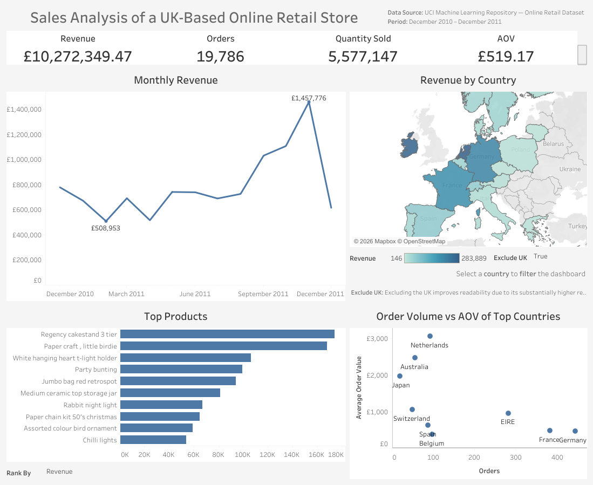

# UK Online Retail Sales Analysis

## Overview

Analysis of sales data from a UK-based online retail store covering December 2010 to December 2011.

The project explores sales performance, monthly revenue trends, product performance and country-level sales using SQL and Tableau.

## Tools

- PostgreSQL
- SQL
- Tableau Public

## Key Analysis

- Total revenue, orders, quantity sold and Average Order Value (AOV)
- Monthly revenue and revenue growth
- Product performance by revenue and quantity sold
- Country-level revenue, orders and AOV

## Dashboard

[View the interactive Tableau dashboard](https://public.tableau.com/views/SalesAnalysisOfUKOnlineRetailStore/D2?:language=en-GB&:sid=&:display_count=n&:origin=viz_share_link)

## Data Source

UCI Machine Learning Repository — Online Retail Dataset
